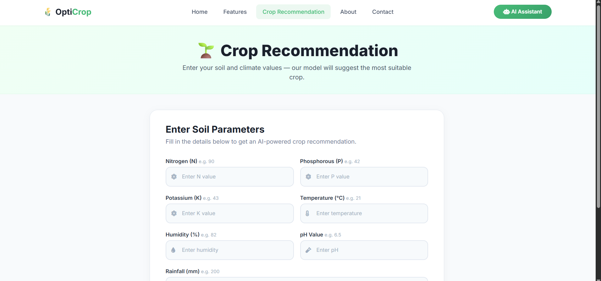
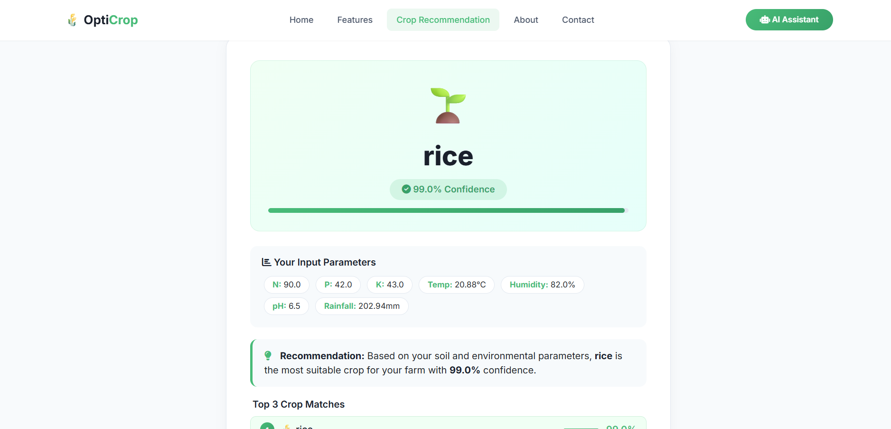
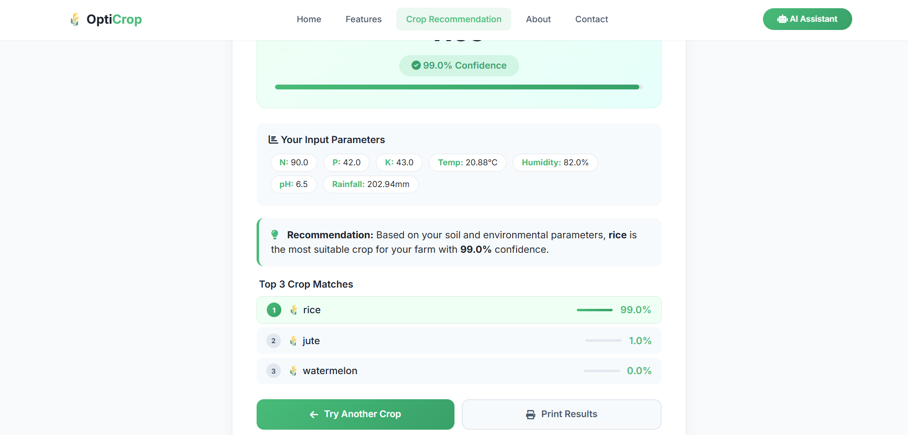

# 🌾 OptiCrop – Project Overview

---

## 📌 Project Title

### **OptiCrop: Smart Agricultural Production Optimization Engine**

---

## 📖 Project Description

OptiCrop is an AI-powered agricultural recommendation system designed to assist farmers in selecting the most suitable crops based on soil nutrient composition and environmental conditions. By leveraging Machine Learning techniques, the system analyzes critical agricultural parameters and provides intelligent crop recommendations that support informed decision-making.

The platform combines data analytics, predictive modeling, and a user-friendly web interface to deliver accurate and real-time crop recommendations.

---

## 🎯 Problem Statement

Agriculture remains one of the most important sectors worldwide, yet many farmers continue to face challenges in identifying the most suitable crops for their land.

Common challenges include:

* Difficulty in selecting appropriate crops.
* Inefficient use of fertilizers and water resources.
* Reduced agricultural productivity.
* Financial losses due to poor crop choices.
* Environmental degradation caused by unsustainable practices.

These challenges highlight the need for a data-driven recommendation system capable of analyzing soil and environmental conditions to guide crop selection.

---

## 💡 Proposed Solution

OptiCrop addresses these challenges through an intelligent Machine Learning-based recommendation engine.

The system:

* Analyzes soil nutrient levels and environmental conditions.
* Predicts the most suitable crop for cultivation.
* Provides confidence-based recommendations.
* Displays alternative crop options.
* Generates results in real time through a web application.

---

## 🚀 Key Features

### 🌱 Intelligent Crop Recommendation

Provides crop recommendations based on scientific analysis of agricultural parameters.

### 📊 Multi-Parameter Analysis

Evaluates seven important factors:

* Nitrogen (N)
* Phosphorous (P)
* Potassium (K)
* Temperature
* Humidity
* Soil pH
* Rainfall

### 🎯 Confidence-Based Predictions

Displays confidence scores for each recommendation to improve transparency and decision-making.

### 🏆 Top 3 Crop Matches

Provides the three most suitable crop recommendations ranked by confidence level.

### ⚡ Real-Time Results

Generates predictions instantly through a web-based interface.

### 🤖 AI Assistant

Offers user support and project-related information through an interactive assistant.

### 📱 Responsive Interface

Designed to work across desktop and mobile devices.

---

## 🛠 Technologies Used

### Backend

* Python 3.x
* Flask
* Scikit-learn

### Data Processing

* Pandas
* NumPy

### Data Visualization

* Matplotlib
* Seaborn

### Frontend

* HTML5
* CSS3
* Bootstrap 5
* JavaScript

### Machine Learning

* Random Forest Classifier
* Logistic Regression
* K-Nearest Neighbors (KNN)

---

## 📊 Model Performance

| Metric     | Value         |
| ---------- | ------------- |
| Best Model | Random Forest |
| Accuracy   | 99.86%        |
| Precision  | 99.85%        |
| Recall     | 99.85%        |
| F1 Score   | 99.85%        |

---

## 🌍 Impact

### 🌾 Agricultural Impact

* Improves crop selection accuracy.
* Supports evidence-based farming decisions.
* Enhances agricultural productivity.

### 💧 Resource Optimization

* Promotes efficient use of fertilizers and water.
* Reduces unnecessary resource consumption.

### 🌱 Environmental Sustainability

* Encourages sustainable farming practices.
* Supports long-term soil health and conservation.

### 💰 Economic Benefits

* Reduces the risk of crop failure.
* Improves farm profitability.
* Supports rural economic development.

### 📚 Educational Value

* Demonstrates practical applications of Machine Learning in agriculture.
* Serves as a learning platform for students and researchers.

---

## 🎯 Project Objectives

* Develop an intelligent crop recommendation system.
* Improve agricultural decision-making through Machine Learning.
* Reduce resource wastage.
* Increase crop productivity and profitability.
* Promote sustainable agricultural practices.

---

## 🔮 Future Scope

* Mobile Application Development
* Weather Forecast Integration
* Fertilizer Recommendation System
* Yield Prediction Module
* IoT Sensor Integration
* Multi-Language Support
* Cloud Deployment
* Advanced Analytics Dashboard

---

## 👥 Target Audience

### Primary Users

* Farmers
* Agricultural Extension Workers
* Agribusiness Professionals

### Secondary Users

* Agricultural Researchers
* Students and Educators
* Policymakers
* Government Agencies

---

### 🌾 OptiCrop – Empowering Agriculture Through Artificial Intelligence

Building smarter, more sustainable, and data-driven farming solutions for the future.
