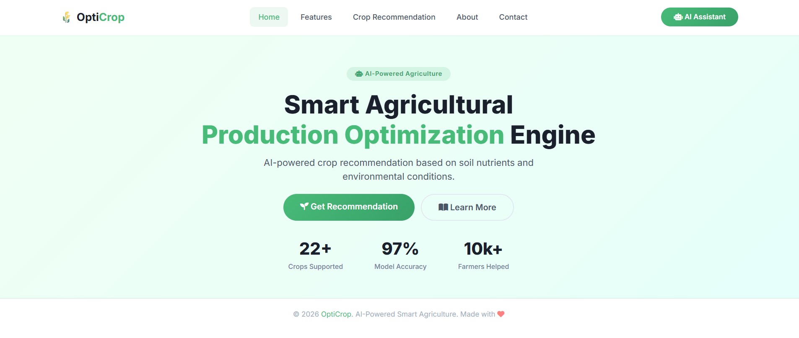

# 🛠️ Technology Stack

The OptiCrop system combines modern web technologies, data processing libraries, and Machine Learning algorithms to deliver intelligent crop recommendations through a responsive web application.

---

## ⚙️ Backend Technologies

The backend is responsible for handling user requests, processing data, and generating crop recommendations.

| Technology   | Version | Purpose                         |
| ------------ | ------- | ------------------------------- |
| Python       | 3.11    | Core programming language       |
| Flask        | 2.2.2   | Web application framework       |
| Scikit-learn | 1.1.3   | Machine Learning implementation |
| Pandas       | 1.5.2   | Data manipulation and analysis  |
| NumPy        | 1.23.5  | Numerical computations          |

### Backend Responsibilities

* Handle user requests and responses
* Process agricultural input data
* Integrate Machine Learning models
* Generate crop recommendations
* Return prediction results to the user interface

---

## 🎨 Frontend Technologies

The frontend provides a responsive and user-friendly interface for interacting with the system.

| Technology     | Purpose                             |
| -------------- | ----------------------------------- |
| HTML5          | Structure and content               |
| CSS3           | Styling and layout                  |
| Bootstrap 5    | Responsive design and UI components |
| JavaScript     | Client-side interactivity           |
| Font Awesome 6 | Icons and visual enhancements       |

### Frontend Features

* Responsive web design
* Easy navigation
* Interactive forms
* Real-time result display
* Mobile-friendly interface



---

## 🤖 Machine Learning Technologies

The prediction engine is built using supervised learning algorithms trained on agricultural data.

### Algorithms Evaluated

| Algorithm                 | Accuracy |
| ------------------------- | -------- |
| Random Forest             | 99.86% ✅ |
| Logistic Regression       | 96.36%   |
| K-Nearest Neighbors (KNN) | 95.68%   |

### Selected Model

#### 🌟 Random Forest Classifier

Random Forest was selected as the final model because it achieved the highest performance among all evaluated algorithms.

**Advantages:**

* High prediction accuracy
* Robust against overfitting
* Handles complex feature relationships
* Performs well on agricultural datasets

---

## 📊 Data Processing Libraries

The following libraries support preprocessing, analysis, and model training:

### Pandas

Used for:

* Data loading
* Data cleaning
* Feature manipulation
* Exploratory Data Analysis

### NumPy

Used for:

* Numerical operations
* Array processing
* Mathematical computations

### Scikit-learn

Used for:

* Model training
* Feature scaling
* Label encoding
* Performance evaluation

---

## 🏗️ Architecture Overview

```text
User Interface
      ↓
Flask Backend
      ↓
Data Processing
(Pandas + NumPy)
      ↓
Machine Learning Model
(Random Forest)
      ↓
Prediction Results
```

---

## 📈 Benefits of the Technology Stack

### Performance

* Fast prediction generation
* Efficient data processing
* Lightweight deployment

### Scalability

* Easy integration of new features
* Supports future cloud deployment
* Extensible architecture

### Reliability

* Mature and widely adopted technologies
* Proven Machine Learning libraries
* Consistent prediction performance

### Maintainability

* Modular code structure
* Well-documented frameworks
* Easy future enhancements

---

## 🚀 Future Technology Enhancements

* REST API Integration
* Cloud Deployment (AWS/Azure/GCP)
* Mobile Application Development
* IoT Sensor Integration
* Real-Time Weather APIs
* Advanced Analytics Dashboard

---

### 🌾 OptiCrop – Smart Agricultural Production Optimization Engine

Leveraging modern web technologies and Machine Learning to enable intelligent, data-driven agricultural decision-making.
