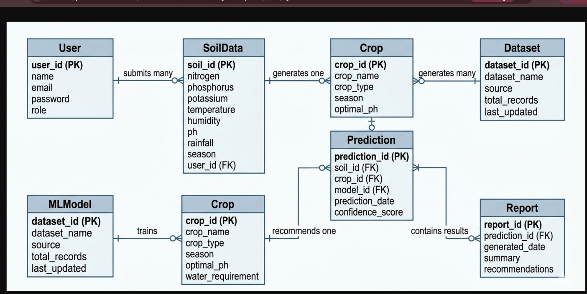

# 📊 Entity Relationship Diagram (ERD)

## ER Diagram

## Entities Description

### 1. User
Stores user information for farmers, researchers, and policymakers.

| Column | Type | Description |
|:---|:---|:---|
| user_id | INT (PK) | Unique user ID |
| name | VARCHAR | Full name |
| email | VARCHAR | Email address |
| password | VARCHAR | Encrypted password |
| role | ENUM | Farmer/Researcher/Policymaker |

### 2. SoilData
Stores soil and environmental parameters entered by users.

| Column | Type | Description |
|:---|:---|:---|
| soil_id | INT (PK) | Unique soil ID |
| user_id | INT (FK) | References User |
| nitrogen | FLOAT | Nitrogen content |
| phosphorus | FLOAT | Phosphorous content |
| potassium | FLOAT | Potassium content |
| temperature | FLOAT | Temperature (°C) |
| humidity | FLOAT | Humidity (%) |
| ph | FLOAT | pH value |
| rainfall | FLOAT | Rainfall (mm) |
| season | VARCHAR | Growing season |

### 3. Crop
Stores information about different crops.

| Column | Type | Description |
|:---|:---|:---|
| crop_id | INT (PK) | Unique crop ID |
| crop_name | VARCHAR | Name of the crop |
| crop_type | VARCHAR | Type of crop |
| season | VARCHAR | Recommended season |
| optimal_ph | FLOAT | Optimal pH range |
| water_requirement | VARCHAR | Water needed |

### 4. Prediction
Stores crop recommendation results.

| Column | Type | Description |
|:---|:---|:---|
| prediction_id | INT (PK) | Unique prediction ID |
| soil_id | INT (FK) | References SoilData |
| crop_id | INT (FK) | References Crop |
| model_id | INT (FK) | References MLModel |
| prediction_date | DATETIME | Date of prediction |
| confidence_score | FLOAT | Confidence percentage |

### 5. MLModel
Stores machine learning model information.

| Column | Type | Description |
|:---|:---|:---|
| model_id | INT (PK) | Unique model ID |
| model_name | VARCHAR | Model name |
| accuracy | FLOAT | Model accuracy |
| dataset_id | INT (FK) | References Dataset |

### 6. Dataset
Stores dataset information.

| Column | Type | Description |
|:---|:---|:---|
| dataset_id | INT (PK) | Unique dataset ID |
| dataset_name | VARCHAR | Dataset name |
| source | VARCHAR | Data source |
| total_records | INT | Number of records |
| last_updated | DATE | Last update date |

### 7. Report
Stores generated reports.

| Column | Type | Description |
|:---|:---|:---|
| report_id | INT (PK) | Unique report ID |
| prediction_id | INT (FK) | References Prediction |
| generated_date | DATE | Report date |
| summary | TEXT | Summary |
| recommendations | TEXT | Recommendations |

## Relationships

| Relationship | Type | Description |
|:---|:---|:---|
| User → SoilData | One-to-Many | One user can have many soil samples |
| SoilData → Prediction | One-to-One | Each soil sample gets one prediction |
| Crop → Prediction | One-to-Many | One crop can be recommended many times |
| MLModel → Prediction | One-to-Many | One model can make many predictions |
| Dataset → MLModel | One-to-Many | One dataset can train many models |
| Prediction → Report | One-to-One | Each prediction can generate one report |

## SQL Schema

See `schema.sql` for the complete database schema.